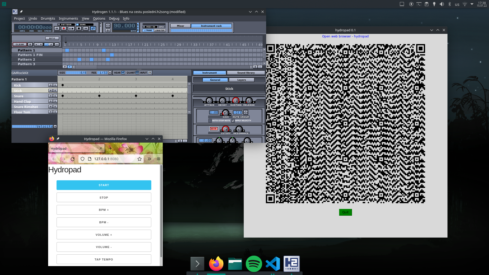

# Mobile drumpad for hydrogen
> Turns mobile phone into remote control for hydrogen.

> Handy for garage bands, multiple musicans can control one drummer ;)

> MIDI websocket support.

> Design your own `index.html`

# How to run
1) Run `python HydroApp.py`
2) Scan QR code with mobile phone
3) Control hydrogen/MIDI/OSC with your phone 

**Do not forget!**
* Check configuration `hydropad.ini`
* Please enable OSC support in hydrogen.

### Notes
Works only if your hydropad server is reachable from your phone - you must be on same (wifi) network.
I have currently no simple idea how solve this problem.

### Manjaro fix - OMG!
pacman -S tk
xrdb -load /dev/null
xrdb -query

### Libs
`pip -r requirements.txt`

# Revision history
* [01-15-2022] Started work on MIDI support - concept OK -> move to MIDI. Web socket needed
* [02-17-2021] First prototype

# TODO
* Some packaging (flatpak?)

Pavel Prchal, 2022

